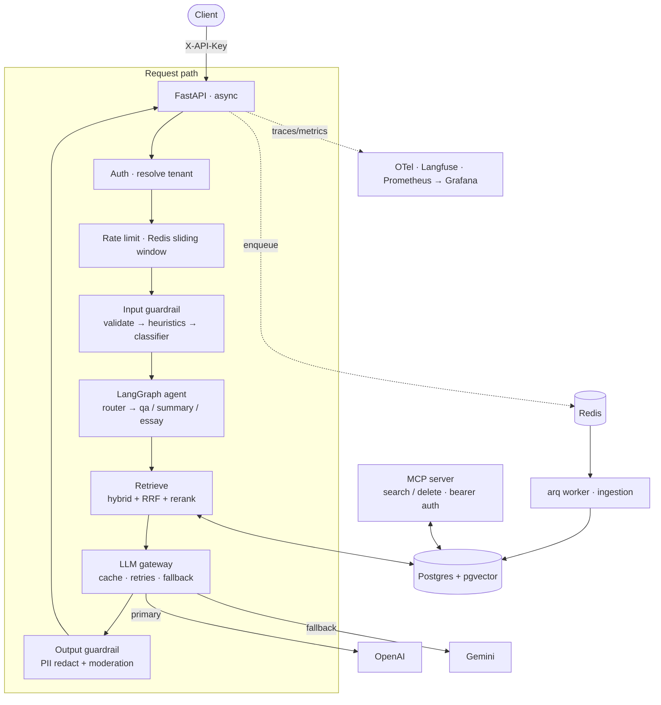

# Agentic RAG — Production-Grade Document Assistant

> A retrieval-augmented generation system you can actually put in front of users: an agent that answers questions, summarizes, and writes essays over your documents — built with **evals, observability, security, and backend hardening** as first-class concerns, not afterthoughts.


Most RAG demos call an LLM and stop there. This one is built the way a production system is: every retrieval and generation change is backed by a **before/after number**, the whole request path is **async**, prompt-injection and PII are **actively defended and measured**, and it's **multi-tenant** with rate limiting, a background queue, and versioned migrations.

---

## Why this project is different

| Layer | What most demos do | What this does |
|---|---|---|
| **Retrieval** | dense top-k | hybrid (vector + BM25/FTS) fused with **RRF**, then **cross-encoder reranking**; measured at each step |
| **Evals** | eyeball a few answers | golden dataset + **retrieval metrics** (recall/MRR) + **LLM-as-judge** (correctness/faithfulness) + a **CI gate** that blocks regressions |
| **Agents** | one prompt | **LangGraph** router → Q&A / summary / essay, conditional decomposition, durable **Postgres checkpoints**, safety rails (loop + cost ceilings) |
| **Security** | none | structural **prompt-injection** defense, layered input/output **guardrails**, **PII** redaction, and a **red-team eval** in the gate |
| **Observability** | `print()` | structured logs + **OpenTelemetry** traces + **Langfuse** + **Prometheus/Grafana** dashboards + alerts |
| **Backend** | sync, single-tenant | **fully async**, **Redis** rate limiting, **arq** background ingestion, **Alembic** migrations, **API-key auth + tenant isolation** |

---

## Results (the proof)

**Retrieval + generation** — each improvement A/B-measured against a golden dataset *(`evals/RESULTS.md`)*:

| Change | Recall@5 | Correctness (LLM-judge) |
|---|---:|---:|
| Baseline (fixed chunks, dense top-k) | 0.80 | 3.40 / 5 |
| + text cleaning → structure-aware chunking | 1.00 | 4.20 / 5 |
| + hybrid search + **cross-encoder reranking** | **1.00** | **5.00 / 5** |
| Expanded to 13 harder questions (current) | 0.923 | 4.85 / 5 |

**Security** — a red-team set scored as Attack-Success-Rate / False-Positive-Rate, wired into the same gate:

| Metric | Value | Meaning |
|---|---:|---|
| Attack Success Rate | **0.000** | no injection/jailbreak got through |
| False Positive Rate | **0.000** | no benign request wrongly blocked |
| Indirect injection | **PWNED → neutralized** | a poisoned doc hijacked the model, then couldn't after the fix |

---

## Architecture



**Request lifecycle:** `auth → rate limit → input guard → agent/retrieval → generation → output guard`. Ingestion is offloaded to a background **arq** worker so uploads return instantly. Everything is traced and measured.

---

## Tech stack

- **Language/tooling:** Python 3.12, [uv](https://docs.astral.sh/uv/), `src/` layout, ruff, pytest
- **API:** FastAPI (fully async) + uvicorn
- **Data:** Postgres + **pgvector** (HNSW), **Alembic** migrations, `psycopg` 3 + `psycopg_pool`
- **Retrieval:** OpenAI `text-embedding-3-small`, Postgres FTS, RRF, `sentence-transformers` cross-encoder reranker
- **Generation:** OpenAI `gpt-4o-mini` (Gemini fallback via OpenAI-compatible endpoint)
- **Agents:** LangGraph (+ Postgres checkpoints), MCP server (STDIO + streamable HTTP)
- **Infra:** Redis (rate limiting + **arq** queue), Docker Compose
- **Evals:** golden dataset, LLM-as-judge, eval-gated GitHub Actions CI
- **Observability:** structlog, OpenTelemetry, Langfuse, Prometheus + Grafana + Alertmanager
- **Security:** Microsoft Presidio (PII), OpenAI moderation, custom prompt-injection defenses

---

## Quick start

**Prerequisites:** Docker, `uv`, and an OpenAI API key.

```bash
# 1. clone + install
git clone https://github.com/skmdnurujjaman/rag-system.git && cd rag-system
uv sync

# 2. configure secrets
cp .env.example .env       # then fill in OPENAI_API_KEY (and optionally GEMINI/LANGFUSE keys)

# 3. start infra (Postgres, Redis, Prometheus, Grafana, Alertmanager)
docker compose up -d

# 4. create the schema (versioned migrations)
uv run alembic upgrade head

# 5. ingest a document under the default tenant (id 1)
uv run python -m rag.ingestion.pipeline data/RAG_Study_Notes.pdf

# 6. run the API + the background worker
uv run uvicorn rag.api.main:app --host 0.0.0.0 --port 8000
uv run arq rag.worker.WorkerSettings        # separate terminal
```

Ask a question (the default tenant's local dev key is `dev-tenant-key`):
```bash
curl -s -X POST http://localhost:8000/query \
  -H "Content-Type: application/json" -H "X-API-Key: dev-tenant-key" \
  -d '{"question":"What is chunk overlap and why does it matter?"}' | python3 -m json.tool
```

---

## API

All endpoints require an `X-API-Key` header (except `/metrics`).

| Method | Path | Description |
|---|---|---|
| `POST` | `/query` | Grounded, cited answer (agentic Q&A) |
| `POST` | `/query/stream` | Same, streamed as Server-Sent Events |
| `POST` | `/summarize` | Summarize a document you own (`document_id`) |
| `POST` | `/essay` | Write an essay on a topic, grounded in your docs |
| `POST` | `/documents` | Upload a PDF → enqueues background ingestion → `202` + `job_id` |
| `GET`  | `/documents/{job_id}` | Ingestion job status |
| `GET`  | `/metrics` | Prometheus metrics |

Create additional tenants (each gets its own isolated data + rate-limit bucket):
```bash
uv run python scripts/create_tenant.py acme     # prints an API key ONCE — save it
```

---

## Evals — the quality gate

```bash
uv run python -m evals.check_gate
```
Runs retrieval metrics, generation LLM-judge scores, and the security red-team set against thresholds. The same command runs in CI on every push — a regression (quality *or* security) turns the build red.

---

## Observability

- **Prometheus** → http://localhost:9090 · **Grafana** → http://localhost:3000 (`admin`/`admin`)
- p95 latency, cost/query, error rate, cache-hit rate, and rate-limit/guardrail counters
- Full request traces in **Langfuse** (prompts, tokens, cost) and **OpenTelemetry** spans

<!-- Add a Grafana dashboard screenshot here — visual proof is worth a lot -->

---

## Project structure

```
src/rag/
  api/            FastAPI app (async endpoints, lifespan, auth + rate-limit deps)
  agents/         LangGraph router + qa / summary / essay agents
  gateway/        LLM gateway (cache, retries, provider fallback, moderation) + semantic cache
  retrieval/      hybrid search, RRF, reranker, query transforms
  ingestion/      load → clean → chunk → embed → store pipeline
  security/       prompt-injection fence, input/output guardrails (PII + moderation)
  db/             async connection pool
  auth.py · ratelimit.py · worker.py · observability.py · mcp_server.py
evals/            golden dataset, LLM-judge, security red-team, CI gate
alembic/          versioned migrations
monitoring/       Prometheus, Grafana, Alertmanager configs
learn/            phase-by-phase build write-ups (how & why, every decision)
```

## License

MIT © skmdnurujjaman
